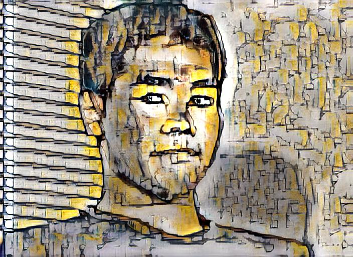
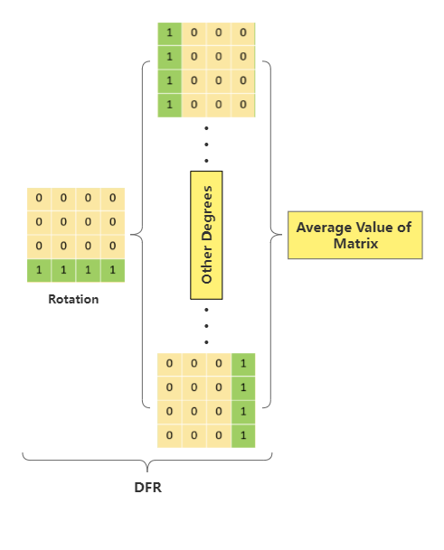

# Style Transfer Based on DFR and AdaIN
 

---

## Overview

---

## Results

Our results compared with other models.

Ours(1) use 0°, 90°, 180°, 270°

Ours(2) use 45°, 135°, 225°, 315°

Ours(3) use 0°, 45°, 90°, 135°, 180°, 225°, 270°, 315°

---

## Getting started

### Installation

Check the `requirements.txt`:

`pip install -r requirements.txt`

### Data

Prepare the style images and content images, the default data path is `./input/content` and `./input/style`

### Train

### Test

