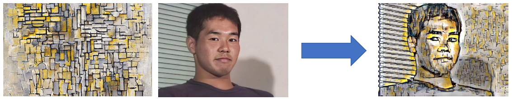
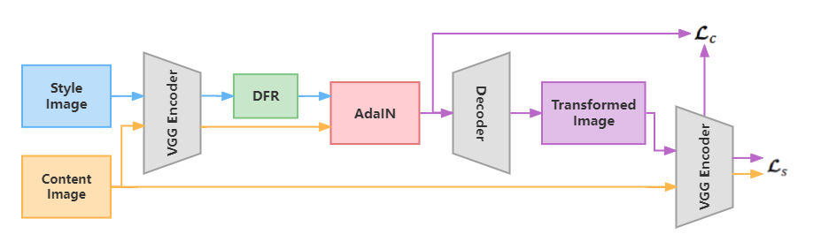
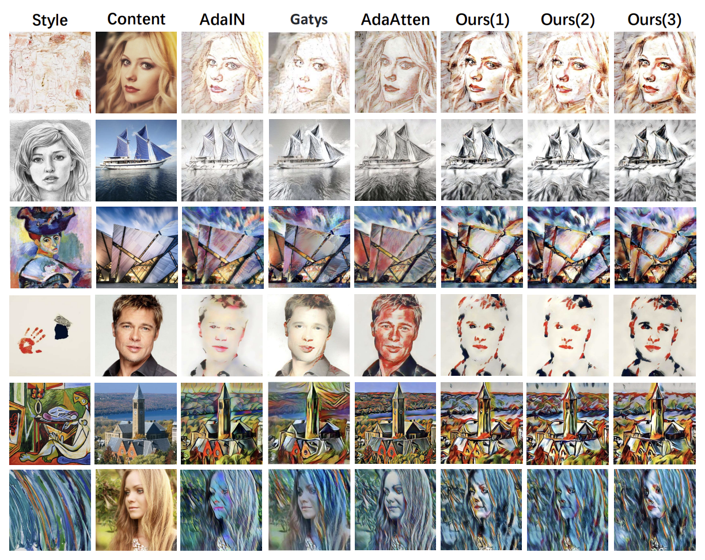

# Style Transfer Based on DFR and AdaIN


[zh-CN](./doc/zh-ch.md)



##### Abstract

>Style transfer is an attractive point in recent years. This tech needs an image to provide its style, and a neural network is applied to transfer the style onto a content target. Most of the existing methods aim to obtain the weight parameters by training on a single image feature and continuously optimizing the network structure to improve the computational efficiency and image quality, but these methods only consider the image features from a certain perspective, which may lead to some information loss. In this paper, we add Deep Feature Rotation (DFR) to the AdaIN network, which enables us to generate multiple features from one image feature by rotation and train these features synthetically. By this method, we can perform comprehensive feature extraction on a stylized image to preserve more complete feature information. We have tried different combinations of angles and also compared them with other methods.

## Overview

This is an image style transformation model. This model is based on `AdaIN` [1], and a `DFR` layer [2] is added between `VGG Encoder` and `AdaIN` to achieve better style conversion.

The network structure is shown as follows:



## Results

The following is a comparison of our results with other algorithms, where:
1. Ours(1) use 0°, 90°, 180°, 270°
2. Ours(2) use 45°, 135°, 225°, 315°
3. Ours(3) use 0°, 45°, 90°, 135°, 180°, 225°, 270°, 315°



## Get started

### Installation

Check the `requirements.txt`:

`pip install -r requirements.txt`

### Data

Prepare the style images and content images, the default data path is `./input/content` and `./input/style`

### Train

Run the following command to test:

```commandline
python train.py [--content content_path --style style_path --encoder encoder_path]
```

Optional parameters are shown in the following table:

| Parameter      | Introduction                                                     |
|----------------|------------------------------------------------------------------|
| content        | Path to content images.                                          |
| style          | Path to style images.                                            |
| encoder        | Path of pre-training model. The default is `models/encoder.pth`. |
| save           | Path for saving model. The default is `experiments`.             |
| log            | Path for saving log. The default is `logs`.                      |
| lr             | Learning rate                                                    |
| decay          | The decay of learning rate                                       |
| epoch          | The iteration number                                             |
| batch          | The batch size                                                   |
| content_weight | The weight of content loss.                                      |
| style_weight   | The weight of style loss.                                        |
| n_threads      | The number of threads.                                           |
| save_interval  | How many iterations to save a model.                             |

### Test

Run the following command to test:

```commandline
python test.py [--content content_path --style style_path]
```

Optional parameters are shown in the following table:

| Parameter    | Introduction                                                      |
|--------------|-------------------------------------------------------------------|
| content      | Path to the content image.                                        |
| style        | Style image path.                                                 |
| encoder      | Path to the encoder. The default is `models/encoder.pth`.         |
| decoder      | Path to the decoder. The default is `models/decoder.pth`.         |
| output       | Path to output the resulting image.                               |
| content_size | Specifies a size for the content image. The default is 512.       |
| style_size   | Specifies a size for the style image. The default is 512.         |
| save_ext     | The extension to use when saving the image.                       |
| alpha        | The degree of control style conversion should be between 0 and 1. |

## Reference

[1] [Arbitrary Style Transfer in Real-time with Adaptive Instance Normalization](https://arxiv.org/pdf/1703.06868.pdf)

[2] [Deep Feature Rotation for Multimodal Image Style Transfer](https://arxiv.org/pdf/2202.04426.pdf)