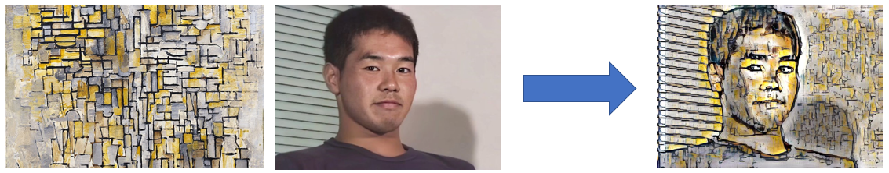

# Style Transfer Based on DFR and AdaIN


[en-UK](../readme.md)



## Overview

这是一个图像风格转换模型。此模型以 `AdaIN` 为基础 [1]，在 `VGG Encoder` 和 `AdaIN` 之间加入了 `DFR` 层 [2] 以实现效果更好的风格转换。

网络结构如下图：


`DFR` 是将特征进行多个角度旋转以从一张风格图像提取多个不同特征的方法 [2]。在本实验中，我们把旋转得到的不同特征取平均值，由此得到一张风格图像更加全面的特征信息。

实现过程如下图：


## Results

以下是我们的结果与其它算法的对比，其中：
1. Ours(1) 使用的角度为：0°, 90°, 180°, 270°
2. Ours(2) 使用的角度为：45°, 135°, 225°, 315°
3. Ours(3) 使用的角度为：0°, 45°, 90°, 135°, 180°, 225°, 270°, 315°


## Getting started

### Installation

使用 `requirements.txt` 文件:

`pip install -r requirements.txt`

### Data

准备好风格图像和内容图像，它们的默认路径分别为 `./input/content` 和 `./input/style`

### Train

运行如下命令以进行训练：

```commandline
python train.py [--content content_path --style style_path --encoder encoder_path]
```

可选的参数见下表：

| 参数             | 说明                                |
|----------------|-----------------------------------|
| content        | 内容图像的路径                           |
| style          | 风格图像的路径                           |
| encoder        | 预训练模型的路径，默认为 `models/encoder.pth` |
| save           | 模型保存路径，默认为 `experiments`          |
| log            | 日志保存路径，默认为 `logs`                 |
| lr             | 学习率                               |
| decay          | 学习率的衰减率                           |
| epoch          | 迭代次数                              |
| batch          | The batch size                    |
| content_weight | content loss 的权重                  |
| style_weight   | style loss 的权重                    |
| n_threads      | 启用的线程数                            |
| save_interval  | 迭代多少次保存一次模型                       |


### Test

运行如下命令以进行测试：

```commandline
python test.py [--content content_path --style style_path]
```

可选的参数见下表：

| 参数           | 说明                              |
|--------------|---------------------------------|
| content      | 内容图像的路径                         |
| style        | 风格图像的路径                         |
| encoder      | 编码器的路径，默认为 `models/encoder.pth` |
| decoder      | 解码器的路径，默认为 `models/decoder.pth` |
| output       | 输出结果图像的路径                       |
| content_size | 为内容图像指定一个大小，默认为 512             |
| style_size   | 为风格图像指定一个大小，默认为 512             |
| save_ext     | 保存图像时使用的扩展名                     |
| alpha        | 控制风格转换的程度，应该在 0 到 1 之间          |

## Reference

1. [Arbitrary Style Transfer in Real-time with Adaptive Instance Normalization](https://arxiv.org/pdf/1703.06868.pdf)
2. [Deep Feature Rotation for Multimodal Image Style Transfer](https://arxiv.org/pdf/2202.04426.pdf)